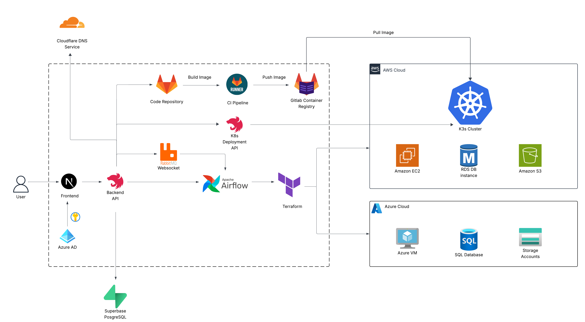

# Orchestronic — Internal Developer Platform (IDP)

Orchestronic is an Internal Developer Platform that lets developers request cloud resources on demand through a single portal, while admins approve requests and the system provisions everything automatically.

It’s built to reduce manual DevOps work, standardize provisioning, and speed up delivery for teams that ship on AWS/Azure and Kubernetes.

---

## ✨ What Orchestronic Does

### Roles
- **Developer (Dev)**: signs in, requests resources, checks results, deploys apps
- **IT Engineer / Admin**: reviews and approves requests, governs infra standards
- **Project Manager**: visibility and oversight (process / status / reporting)

### Core Flows
1. **Sign in with Microsoft**
   - Developer role is assigned automatically on first login.
2. **Request resources**
   - **Project Request**: repository, VM, database, storage
   - **Cluster Request**: Kubernetes cluster creation
3. **Admin approval**
4. **Automated provisioning**
   - System provisions approved resources on the configured cloud provider(s)
5. **Developer views results**
   - Project results show created repo/VM/DB/storage
   - Cluster results show readiness + **KubeConfig available** when ready
6. **Deploy to cluster**
   - From a project detail page, dev can deploy the project by selecting a cluster.

---

## 🧩 Architecture (High Level)



- **Frontend**: Web UI for dev/admin workflows
- **Backend API**: Handles auth, request lifecycle, approvals, orchestration triggers
- **Automation/Orchestration**: Provisioning pipelines (e.g., Airflow jobs / scripts)
- **Cloud Providers**:
  - **AWS** (current)
  - **Azure** (supported for some resources / expanding)
- **GitLab Integration**:
  - Self-managed GitLab for repo + CI/CD
  - Build container images and deploy to Kubernetes via the platform

> This is Part 3 of a multi-part project series (continuing from earlier parts built by prior team members).  
> Planned future add-ons are listed below.

---

## ✅ Current Features

- Microsoft SSO login
- Role-based access (Developer/Admin)
- Resource request system (Project + Cluster)
- Admin approval workflow
- Automated provisioning after approval
- Cluster detail page showing readiness state
- KubeConfig availability once cluster is ready
- Project detail page showing provisioned resources
- Deploy project to a chosen cluster

---

## 🗺️ Roadmap (Next Parts / Add-ons)

Planned enhancements:
- **Observability** (logs/metrics/tracing)
- **Key Vault / Secrets management** for credentials
- **Create clusters on Azure** (currently AWS-only for cluster creation)
- **Use pre-defined subnets** during provisioning (Airflow-driven)

---

## 🚀 Getting Started

### Prerequisites
Depending on your setup, you will typically need:
- Microsoft Azure AD app registration (SSO)
- Access to cloud provider credentials (AWS and/or Azure)
- GitLab self-managed instance + API access token
- Kubernetes access for target clusters (when deploying)

### Local Setup (Template)
> Replace placeholders with your repo’s actual commands and paths.

1. Clone the repo
   ```bash
   git clone <your-repo-url>
   cd orchestronic